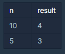

# Q1 소수찾기

### **문제 설명**

* 1부터 입력받은 숫자 n 사이에 있는 소수의 개수를 반환하는 함수, solution을 만들어 보세요.
* 소수는 1과 자기 자신으로만 나누어지는 수를 의미합니다.\
  (1은 소수가 아닙니다.)  &#x20;


제한 조건&#x20;

* n은 2이상 1000000이하의 자연수입니다.



### &#x20;**입출력 예 설명 **



* 입출력 예 #1\
  1부터 10 사이의 소수는 \[2,3,5,7] 4개가 존재하므로 4를 반환
* 입출력 예 #2\
  1부터 5 사이의 소수는 \[2,3,5] 3개가 존재하므로 3를 반환


#### A1. (실패)



```
class Solution {
    public int solution(int n) {
        int answer = 0; 
        
        for(int i=2; i<=n; i++){
            boolean flag = true;  
            for(int j=2; j<i; j++){
                if(i%j==0){
                    flag=false;
                    break;
                }
            }
            if(flag==true)
                answer++;
        }
        return answer;
    }
}
```

}



**코드 실패(효율성 저하)**

가장 쉬운 첫 번째 방법은, 2부터 n까지의 숫자 배열을 만들고 다시 2부터 나눠서 만약 자기 자신으로만 나누어 떨어진다면 소수로 입력하는 것이다. (1은 소수가 아니기에 처음부터 배제한다.) 제한 조건에 n은 1,000,000(백만)이므로 위 방법을 사용하면 시간이 오래 걸릴 것이다.  이 방법도 n까지 모두 나누어 보면서 비교해보는 방법이 아닌 2\~n-1까지 나누어지면 바로 break하는 방법을 사용해서 최대한 실행 수를 줄인다.




**A2. 에라토스테네스의 체**



```
class Solution {
  public int solution(int n) {
    int answer = 0;
    int[] numbers = new int[n+1];
  //2부터 n까지의 수를 배열에 넣는다.
    for(int i=2; i<=n; i++) numbers[i]=i;
 
              //2부터 시작해서 그의 배수들을 0으로 만든다.
          //후에 0이면 넘어가고 아니면 그의 배수들을 다시 0으로 만든다.
      for(int i=2; i<n; i++) {
 
        if(numbers[i] == 0) continue;
 
        for(int j=2*i; j<=n; j+=i) numbers[j] = 0;
      }
    //배열에서 0이 아닌 것들의 개수를 세준다.
      for(int i=0; i<numbers.length; i++) {
 
        if(numbers[i] != 0) answer++;
      }
 
    return answer;
  }
}
```



**#라인6**

먼저 1은 소수가 아니므로 2부터 입력받은 수 n까지 배열에 담는다.

&#x20;

**#라인8, 라인12**

2부터 소수의 배수들을 하나씩 지워나간다. (이 코드에서는 값을 0으로 변경한다)

위와 같은 방식으로 3, 5, 7 ... . 수도 반복한다.

&#x20;

**#라인10**

이 때 배열의 값이 이미 0으로 변경된 것은 넘어간다.

&#x20;

**#라인15\~17**

작업이 끝나면 0이 아닌 수를 세어서 리턴한다.



****

****
